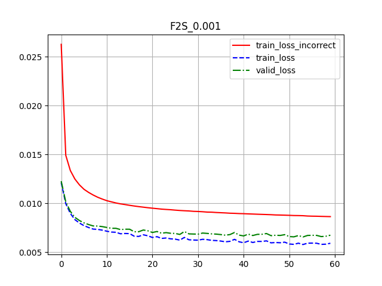
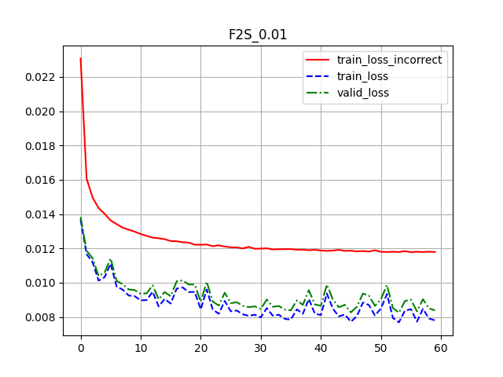
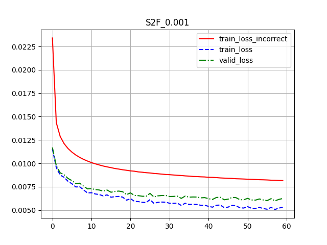
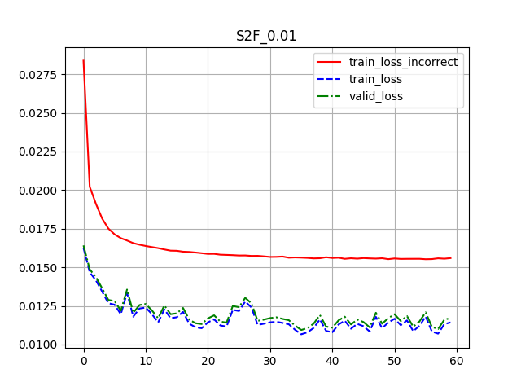

# Configuración 0

```json
{
    "learning_rate": 0.001,
    "dropout": 0.2,
    "batch_size": 100,
    "epochs": 60,
    "S2F": false,
    "train_all": false
}
```



Pérdida de entrenamiento incorrecto: 0.008640918103046714

Pérdida de entrenamiento: 0.005914613652663926

Pérdida de validación: 0.0067393512092530725

# Configuración 1

```json
{
    "learning_rate": 0.01,
    "dropout": 0.2,
    "batch_size": 100,
    "epochs": 60,
    "S2F": false,
    "train_all": true
}
```



Pérdida de entrenamiento incorrecto: 0.011790009012135366

Pérdida de entrenamiento: 0.007799781073505679

Pérdida de validación: 0.00838674587663263

# Configuración 2

```json
{
    "learning_rate": 0.001,
    "dropout": 0.2,
    "batch_size": 100,
    "epochs": 60,
    "S2F": true,
    "train_all": false
}
```



Pérdida de entrenamiento incorrecto: 0.008158766061533242

Pérdida de entrenamiento: 0.005304083267692477

Pérdida de validación: 0.006242909710854292

# Configuración 3

```json
{
    "learning_rate": 0.01,
    "dropout": 0.2,
    "batch_size": 100,
    "epochs": 60,
    "S2F": true,
    "train_all": true
}
```



Pérdida de entrenamiento incorrecto: 0.014699301035143435

Pérdida de entrenamiento: 0.010162276026482384

Pérdida de validación: 0.010614893231540919

