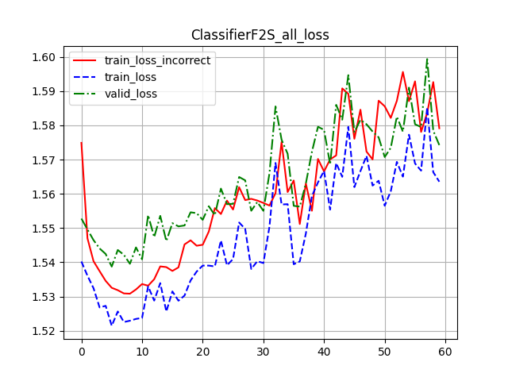
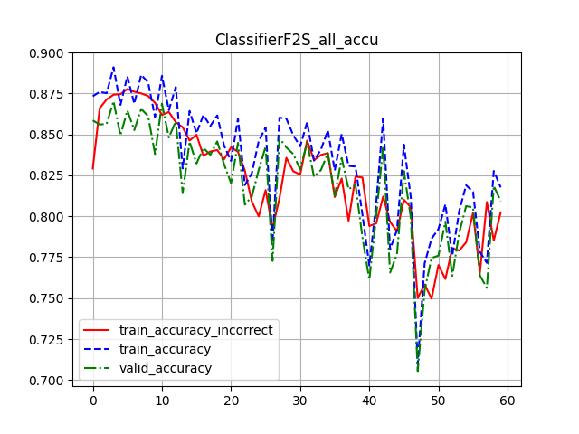
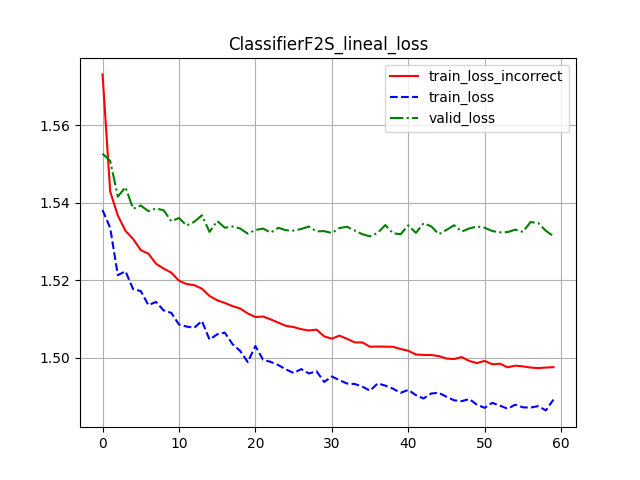
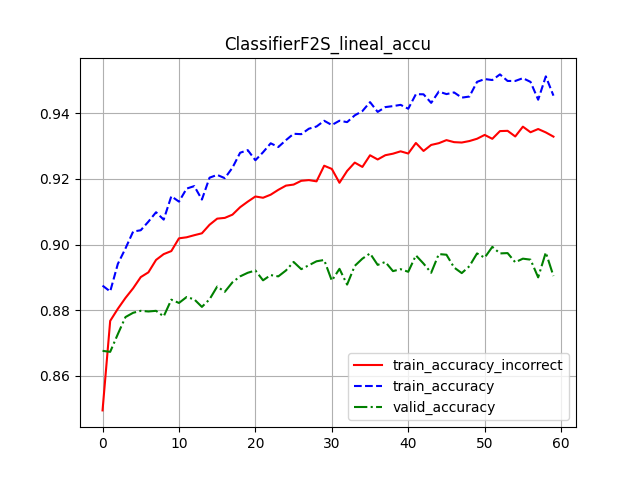
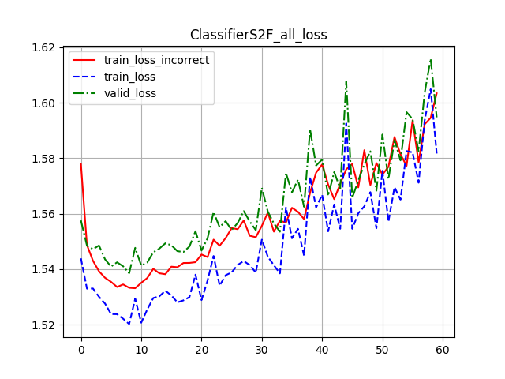
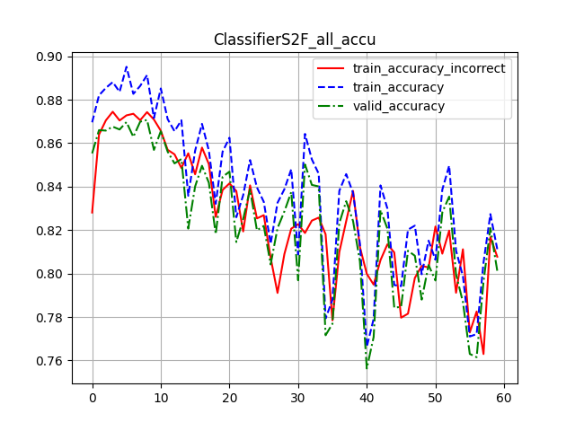
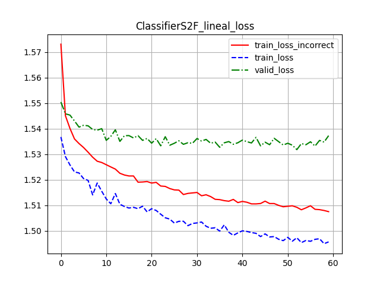
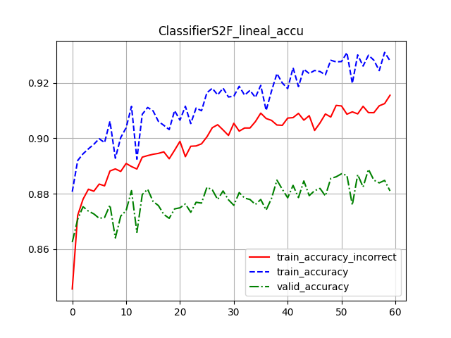

# Configuración 0

```json
{
    "learning_rate": 0.001,
    "dropout": 0.2,
    "batch_size": 100,
    "epochs": 60,
    "S2F": false,
    "train_all": true
}
```





Pérdida de entrenamiento incorrecto: 1.5791297020514805

Pérdida de entrenamiento: 1.5635399874051412

Pérdida de validación: 1.57422727227211

Precision de entrenamiento incorrecto: 0.8023666666666667

Precision de entrenamiento: 0.8176166666666667

Precision de validación: 0.8093

# Configuración 1

```json
{
    "learning_rate": 0.001,
    "dropout": 0.2,
    "batch_size": 100,
    "epochs": 60,
    "S2F": false,
    "train_all": false
}
```





Pérdida de entrenamiento incorrecto: 1.4975731952985127

Pérdida de entrenamiento: 1.4891859356562296

Pérdida de validación: 1.5313775873184203

Precision de entrenamiento incorrecto: 0.9329

Precision de entrenamiento: 0.9453833333333334

Precision de validación: 0.8904

# Configuración 2

```json
{
    "learning_rate": 0.001,
    "dropout": 0.2,
    "batch_size": 100,
    "epochs": 60,
    "S2F": true,
    "train_all": true
}
```





Pérdida de entrenamiento incorrecto: 1.6033872520923615

Pérdida de entrenamiento: 1.5816914023955664

Pérdida de validación: 1.5947244262695313

Precision de entrenamiento incorrecto: 0.80775

Precision de entrenamiento: 0.8112333333333334

Precision de validación: 0.8013

# Configuración 3

```json
{
    "learning_rate": 0.001,
    "dropout": 0.2,
    "batch_size": 100,
    "epochs": 60,
    "S2F": true,
    "train_all": false
}
```





Pérdida de entrenamiento incorrecto: 1.507552704612414

Pérdida de entrenamiento: 1.4957083968321483

Pérdida de validación: 1.5373068964481353

Precision de entrenamiento incorrecto: 0.9155666666666666

Precision de entrenamiento: 0.9280333333333334

Precision de validación: 0.881

